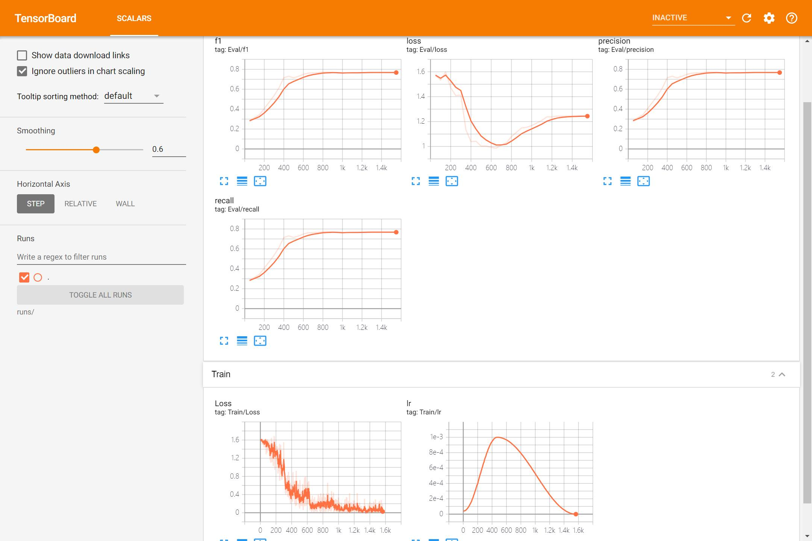

# nlp_2020


Python Boilerplate contains all the boilerplate you need to create a Python package.

- Free software: MIT license
-  Documentation: https://nlp-2020.readthedocs.io.

## FQA

1. 此次实验分组吗?
   - 不分组
2. 项目结构太复杂了?
   - project采用python package的形式组织, 所以会有些复杂, 只需要关注[项目主体](nlp_2020/classification/')就行, 项目只是一个baseline.

## Baseline

### Dataset

&emsp;&emsp;本次文本分类实验为多分类实验, 数据集中文本类别为 5 类: `news_culture, news_car, news_edu, news_house, news_agriculture`.  
&emsp;&emsp;数据集中每一行从左至右的字段为： `example_id, category_code(non-sense), category, example` , 可参考下面的例子.

```sh
# Example with fields separated by '\t'
6523865677881672199	101	news_culture	黄氏祖训、家训——黄姓人家可以鉴读一下
```

### Usage

&emsp;&emsp;Baseline 以 python package 的形式给出, 其分发格式为 egg([wheel 和 egg 区别](https://packaging.python.org/discussions/wheel-vs-egg/)), 如果想使用或者复现 baseline 的话, 请先查看[命令行参数设置](./nlp_2020/classification/args.py)再修改 `scripts/train_classification.sh` . 在复现 baseline 前, 请以下面的代码从本地安装 baseline.

```sh
# Install package if you want use this baseline
pip install -e ./ --no-binary :all:
```

&emsp;&emsp;**NOTE**: baseline 还是一个比较粗糙的草稿, 可能会发现很多无用甚至冗余的 feature.

### Pkgs

&emsp;&emsp;有些 package 并没有在依赖文件 `requirements_dev.txt` 中给出, 要使用 baseline 的话还需要安装下面的 package

```sh
pytorch==1.4.0
cudatoolkit==9.2
tensorboard==2.2.1
scikit-learn==0.22
jieba==0.42.1
```

### Visualize baseline

&emsp;&emsp;baseline 的训练过程可以通过下面的命令可视化.

```sh
tensorboard --logdir=./runs
```



### Reference

&emsp;&emsp;以下为本次实验需要用到的数据集(数据集已经划分为训练集/验证集/测试集), 还有 baseline 使用的预训练词向量, 预训练词向量为在搜狗新闻上使用 SGNS(skip-gram with negative sampling)训练得到的 300 维词向量.

- Data: [link](https://pan.baidu.com/s/1TprekQac-yzNHMsREWZe9g), verification Code: uhxt  
- Pretrained-embedding: [link](https://pan.baidu.com/s/1svFOwFBKnnlsqrF1t99Lnw)  
- Reference: https://github.com/Embedding/Chinese-Word-Vectors

### Assignment

#### content

&emsp;&emsp;本次实验需要利用给出的数据集, 最终提交的形式为压缩包, 压缩包中应该包含 **实验报告(pdf)** 和 **源代码**. 实验报告中至少应有的内容: 预处理过程, 模型结构, 超参数配置, 评估方法, 测试集上的最终结果, tensorboard 可视化训练结果.  
&emsp;&emsp;pdf命名格式应为`学号_分类实验`, e.g. `SA19225001_分类实验`, 压缩包按此格式命名.  
**NOTE**: 源代码应该不含数据集和训练的模型参数.

#### ETA

&emsp;&emsp;请在5月15日晚22:00前发送压缩包至`zacb2018@ustc.mail.edu.cn`.

## Features

- TODO

## Credits

This package was created with [Cookiecutter](https://github.com/audreyr/cookiecutter) and the [audreyr/cookiecutter-pypackage](https://github.com/audreyr/cookiecutter-pypackage) project template.
